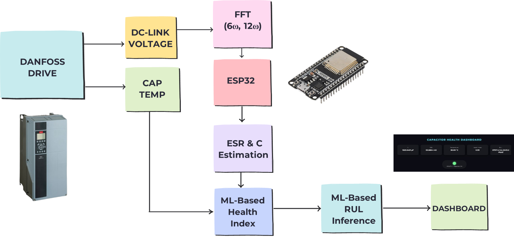
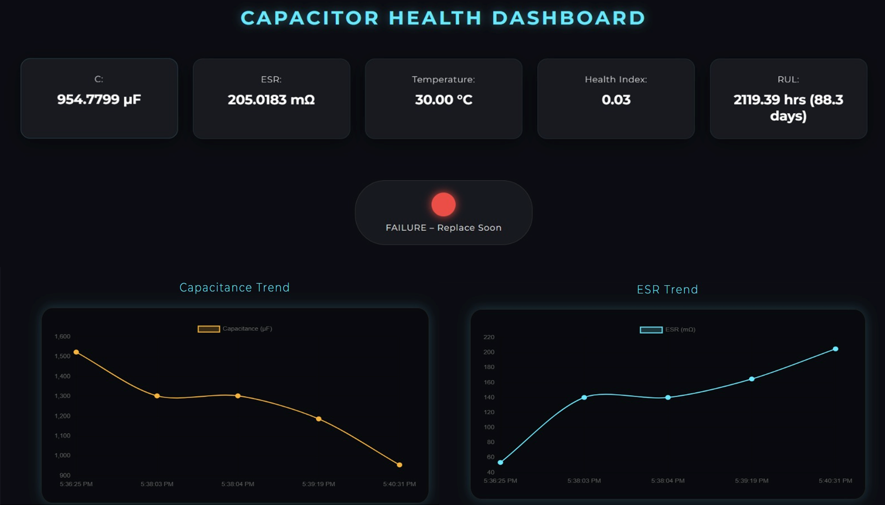

# Capacitor Condition Monitoring: Architecture & Showcase

This repository serves as the public technical showcase for our non-invasive condition monitoring project. 

 

---

### System Architecture
Our solution leverages a hybrid stack spanning edge hardware, physics simulations, and cloud-connected machine learning.

1. **Physical Layer (Simulation):** MATLAB/Simulink models the inverter and DC link capacitor degradation over time, generating voltage ripple data.
2. **Edge Processing (ESP32):** An ESP32 microcontroller calculates real-time ESR and Capacitance using optimized C++ impedance formulas based on the 6th and 12th harmonic frequencies.
3. **ML Inference (Python/XGBoost):** A Python watchdog script runs FFT on the voltage data, communicates with the ESP32 via Serial, and feeds the ESR/C values into a pre-trained XGBoost model to predict Health Index (HI) and Remaining Useful Life (RUL).
4. **Telemetry (MQTT):** The predictions are published to a Mosquitto MQTT broker.
5. **Visualization (Vercel):** A web dashboard subscribes to the MQTT topics to display real-time metrics.

---

### Performance Highlights

> **Hardware Optimization:** Replaced heavy mathematics with precalculated constants and direct multiplication in C++ to save CPU cycles on the ESP32.

> **Hybrid Data:** The ML models are trained on a unique `physics_informed_dataset`, allowing the XGBoost regressor to understand complex, non-linear degradation patterns that pure data-driven models miss.

> **Real-Time Execution:** The end-to-end pipeline operates continuously, updating the dashboard with sub-second latency.

---

### Media

  

